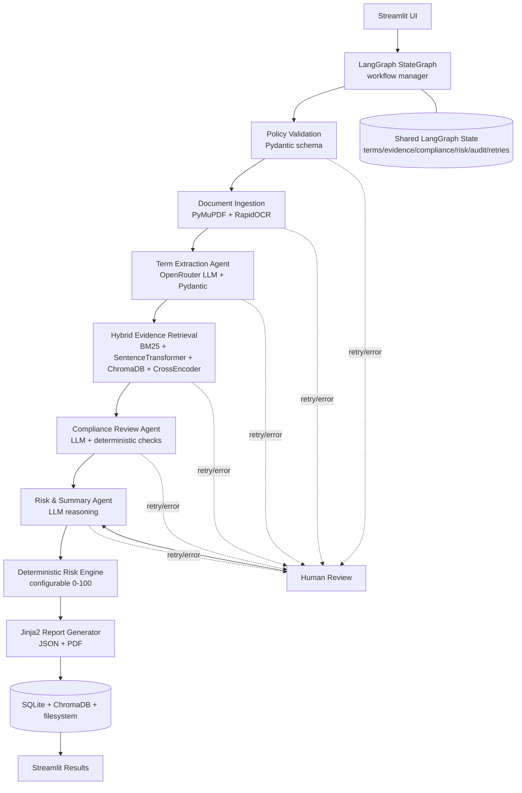

# One-page architecture diagram

Key handoffs: page-aware document chunks -> structured terms -> retrieved evidence -> rule-level compliance results -> grounded risks/summary -> deterministic score -> final report.
